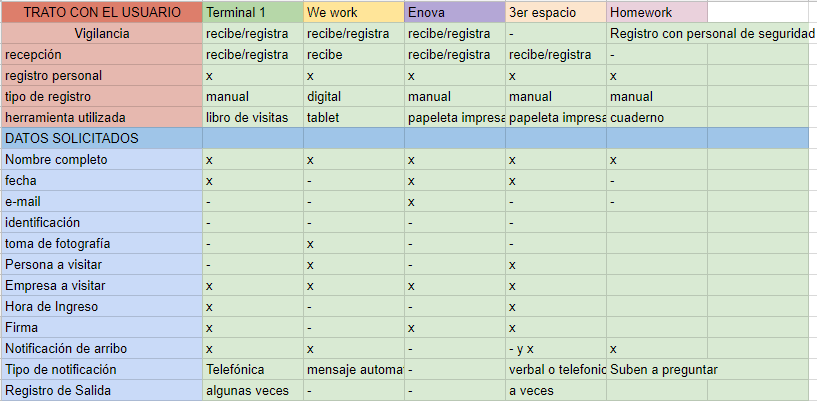

# Registro de Visitantes

### Preludio:

El registro de visitantes en una empresa en América Latina llega a ser un proceso tedioso y muchas veces de forma manual; lo común es que una persona esté en la recepción tomando nota - a veces con papel y lápiz - de cada visitante. Por razones de seguridad, usualmente piden a cada visitante dejar una identificación,  y  se "notifica" a la persona visitada sobre la llegada del visitante,por medio de una llamada telefónica. Si vivimos en la era digital, ¿por qué seguimos registrando visitantes como si fuera 1985? ¿Qué tal si sustituimos a la persona en recepción por una tablet? ¿Qué tal si en lugar de pedir una identificación, tomamos una foto? ¿Qué tal si agilizamos la “notificación” con un simple mensaje de texto?

## El Problema

El proceso de registro en el **75%** de los coworking analizados, incluido Terminal 1 presenta una o varias problematicas derivadas a que el proceso;

* Es realizado de **forma manual** por el visitante en libros de florete rayado o papeletas impresas.
* La información obtenida **no tiene utilidad alguna**, solo en casos de emergencias siempre y cuando se pueda vincular con el video de seguridad.
* Se realiza un **gasto innecesario** en cuanto a impresiones y consumo de papel que no es reutilizado en un 80% de los casos.
* **Dificil detección de visitantes no gratos.**

 
 Lo que conlleva a que el registro sea tardado, tedioso, primitivo, se formen largas filas para realizar el registro y cause retraso en la mayoria de los usuarios que usualmente cuentan con el tiempo justo para acudir a la cita por la que se encuentran en el coworking.

 ## La solución 

 Si se **digitaliza** el proceso de registro en el coworking Terminal 1 por medio de una aplicación web, 
 * Los usuarios podrán **acceder** al coworking de manera **ágil y breve**.
 * Los datos recabados serán de **utilidad estadística** para el administrador.
 * Se podrá tener un **mejor manejo de la seguridad**. 
 * El interés por establecerse en el coworking como colaborador **incrementará**, debido a la innovación en este campo, aumentando la presencia de Terminal 1 en el mercado. 

## Documentación y Proceso de Investigación

Naturalmente tendemos a evolucionar, por eso no podemos negar que la forma de trabajar se transforma constantemente  y la interacción entre las personas es cada vez mucho mayor y necesaria,cuando alguien se anima a emprender y comienza a dar los primeros pasos descubre que gran parte del capital se invierte en los gastos operativos: la renta de un despacho,líneas telefónicas, internet y mensajería. 
Los pilares en los que se basó Brad Neuberg para crear, en 2005, el concepto de trabajo colaborativo llamado coworking fueron: la libertad e independencia de trabajar por tu cuenta combinadas con la estructura y comunidad de colaborar con otros y disminuir gastos.

#### Proceso

Para entender de mejor manera como se desarrolla el proceso de registro, a las personas que lo realizan, encontrar áreas de mejora y una solucón viable a la problemática, se llevó a cabo una investigación de campo, visitando tres coworking ubicados en un radio de mediana dimensión con relación a Terminal 1, siendo este ultimo también evaluado.
Se realizaron algunas entrevistas con usuarios encargados de solicitar y verificar se lleve a cabo el registro (recepcionistas y personal de vigilancia ) de visitas de las cuales se obtuvo información importante sobre el proceso de registro, las notificaciones hacia los coworkers visitados y el uso que se le da a la información recopilada durante el proceso de registro del visitante, destacando que desearían que el proceso se volviera ágil pero no perder el contacto humano que se tiene al realizar el proceso, ya que lo consideran como un hecho importante en su labor diaria.

* **Coworking 3er Espacio Amsterdam 240, CDMX;**

Para poder ingresar al coworking se toca un interfon, preguntan motivo de visita, abren la puerta de seguridad y subes escaleras al 4° piso, ubicacion de la recepción en donde llenas una papeleta impresa con datos como nombre,fecha, a quien visitas; no se notifica a la persona que se visita, si el área de trabajo de esa persona se encuentra abajo tienes que regresar al piso correspondiente.
Se realizó una entrevista a Karen Aldana, product manager de El 3er Espacio, para conocer sus necesidades principales en torno al registro, y en la cual ella nos expreso que le gustaría tener una tablet con una app de registro.
[Audio entrevista a Karen Aldana](https://drive.google.com/file/d/1lV_3ExzYvMEoBfm4Ji1GwQkD1If76Uqk/view?usp=sharing)

* **We Work Insurgentes 601,CDMX;**

El acceso a este coworking tiene tres filtros, el primero es apuntarse en una bitácora en el lobby con la persona de seguridad, un proceso que provoca que rápidamente se forme una fila considerablemente larga, te diriges a los torniquetes de apertura magnetica,tienes que esperar a que otra persona de seguridad te abra con su tarjeta de acceso, pero si vienen personas en sentido contrario tienes que esperar y se hace una aglomeración notable, subes por el elevador y en el piso 11 que en este caso fue el que se visito, se encuentrea otra recepción en la que te indican que te registres por medio de una aplicacion instalada en una tablet, en la que te toman una foto.
Como requisito basico debes conocer el nombre de la persona a quien visitas, ya que la notificación de arribo del visitante se hace  únicamente por medio de un mensaje automático al utilizar el registro digital.

[liga de video de registro](https://drive.google.com/file/d/10vA07pxBGOKSr_sj73Shk4K4bgC8dI-i/view?usp=sharing)

Como en este coworking el registro es digital, me acerque a un usuario para saber a profundidad como es que se siente con tal innnovación del proceso, con su consentimiento previo de poder grabar.[Entrevista a Usuario](https://drive.google.com/file/d/1I3acppzjWW93Z30w0lM7StvtpPbt97OO/view?usp=sharing)

* **Enova Córdoba 56, CDMX;**

El proceso de registro igualmente es manual, anotando fecha, nombre, a quien visitas, motivo y firmaen una libreta que tiene el personal de vigilancia quien amablemente te indican que ruta tomar para llegar al lugar que indicaste previamente asistirías.

* **Terminal 1 Tehuantepec 170, CDMX;**

En este coworking el proceso de registro se puede llevar a cabo en dos partes diferentes del edificio frontal, en la puerta con vigilancia o en recepción, ambas de manera manual y sin petición de identificación de ningúna índole, se notifica al visitado de la llegada del visitante mediante una llamada telefónica, la visita espera a que bajen para atenderlo,  cuando no conocen a la persona preguntan si eres y mencionan el nombre del visitante.
[liga de Audio, entrevista a recepcionista](https://drive.google.com/file/d/116_cju50MXfcDwnMKRBgwRbNpQ5AIZtN/view?usp=sharing)

* **Visitando We Work Varsovia 36, como posible cliente;** 

Una vez agendada una cita, acudí a este coworking para poder recibir informes de como es el ambiente laboral, precios y conocer las instalaciones, el registro es distinto que el de un visitante de alguna empresa ya establecida ahí.
* En vigilancia te piden tu ID y anotar tu nombre y a quien visitas en una libreta, te entregan una credencial que debes portar durante la visita.
* En recepción te registras en una tablet y se le notifica a la persona que visitas por medio de un mensaje enviado por la aplicación de registro.
* Una vez llegado el anfitrión, accedes al área de oficinas y te dan una explicación de sus características físicas y servicios con los cuenta el coworking, así como los precios.
* Despedida del anfitrión y entrega de tu ID.  

## Benchmark

## Argumentación de Diseño

El diseño es **simple e intuitivo**, sin imagenes o colores demasiado llamativos que puedan distraer al usuario de la tarea principal a realizar; el registro.
Se implementó la **gama cromática de la página oficial de Terminal 1**, al igual que el [logotipo](http://terminal1.mx/wp-content/themes/terminal-1-theme1.1//images/header-logo.svg) y la tipografía **Pathway Gothic One** para **los encabezados y titulos** y **PT Sans** para **el texto**, debido a que el coworking ya tiene una identidad definida, y basándonos en las entrevistas orales realizadas a los usuarios, al mostrarles dos posibles diseños, **8 de cada 10** indicaron que el diseño que tiene los colores de Terminal 1 les agradaba terminantemente ya que se mira sencillo, atractivo, balanceado e intuitivo.
Se optó por colocar los botones de cambio de página en la parte superior debido a que es una aplicación que se utilizará en un dispositivo touch, el teclado se despliega por la parte inferior, lo que aumentaría un paso más en el proceso al tener que darle click en alguna parte que no solicite introducción de texto pra poder visualizar el botón que se encuentra en la parte inferior, lo que los usuarios encontraron confuso.
Se utilizaron íconos de flechas para realizar el cambio de pantalla, los usuarios los describieron como intuitivos y agradables a la vista al usarlos, ya que en el primer testing se tenian botones con leyenda "siguiente" los usuarios los notaban como demasiado obvios y aburridos.

## Sketch

## Prototipo de alta fidelidad
[Prototipo clickeable en figma](https://www.figma.com/proto/GIphPyxr0rh3LqmzN29FpyaD/Registro?node-id=10%3A0&scaling=scale-down)

## Arquitectura de Diseño

## Historias de usuario

* Yo como visitante de un coworking quiero registrarme fácilmente sin hacer largas filas.

* Yo como visitante de un coworking quiero  poder esperar al anfitrión tranquilamente, sin esperar que pregunte aleatoriamente si soy una u otra persona.

* Yo como anfitrión quiero recibir notificaciones de un visitante con fotografía, para poder decidir si es o no una visita grata.

* Yo como visitado quiero ser notificado cuando alguien me espera en recepción.

* Yo como coworker quiero tener acceso a la información de las visitas, para fines de seguridad, estadistica y mejora de mis servicios.
 
 ## Testing de usuario

 La primera forma de realizar el testing de usuario fue con un prototipo clickeable de alta fidelidad, permitiendo que el usuario, por instinto accediera a las diferentes funciones de la aplicación, en esta primer etapa las insights obtenidas fueron:
 * Cambiar botones que tengan frase "siguiente" por ícono que intuitivamente lo indique.
 * Diseño sencillo.
 * No pedir demasiados datos. 
 * omitir correo electrónico.
 * Colocar morivo de visita.

  Una vez realizados los cambios la segunda etapa de  testeo de usuario se realizó a cinco personas distintas tanto hombres como mujeres, en un rango de edad que oscila entre los 25-50 años, se grabaron las sesiones con la aplicacion AZ screen recorder, por medio de una tablet, y asi poder verificar que el flujo de la aplicación desarrollada es óptimo, ágil e intuitivo para los usuarios.
    
    [liga de AZ screen recorder]()

